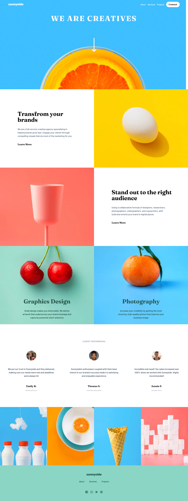

# Frontend Mentor Landing Page challege

```
<!-- clone the project  -->
npm run dev

<!-- Open the file -->
cd <filename>

<!-- Install the dependencies -->
npm insall
pnpm install

<!-- Run the project  -->
npm run dev
pnpm run dev
```

## Preview

### Desktop


